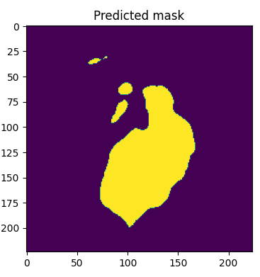

# Leaf Disease Segmentation using U-Net with PyTorch

This is the official repository for the **Leaf Disease Segmentation with U-Net** project. This project focuses on applying Deep Learning to accurately identify and delineate diseased regions on plant leaf images, enabling automated early detection and diagnosis. This implementation uses the PyTorch framework and the `segmentation-models-pytorch` library.

## Table of Contents
- [Leaf Disease Segmentation using U-Net with PyTorch](#leaf-disease-segmentation-using-u-net-with-pytorch)
  - [Table of Contents](#table-of-contents)
  - [About The Project](#about-the-project)
  - [✨ Highlights](#-highlights)
  - [🧠 Model Architecture](#-model-architecture)
  - [💾 Dataset](#-dataset)
  - [⚙️ Prerequisites](#️-prerequisites)
  - [🚀 Installation \& Usage](#-installation--usage)
  - [📊 Results](#-results)
  - [🤝 Contributing](#-contributing)
  - [📜 License](#-license)
  - [📬 Contact](#-contact)

## About The Project

Early disease detection in crops is a critical factor in ensuring food security and improving agricultural efficiency. Traditional methods are often time-consuming and require specialized expertise. This project implements a model based on the renowned **U-Net** architecture to perform image segmentation, allowing for pixel-perfect identification of infected leaf areas.

## ✨ Highlights
- **High Accuracy**: Utilizes the powerful U-Net architecture from the `segmentation-models-pytorch` library, which allows for easy integration of various pre-trained backbones.
- **Automation**: Provides a fully automated pipeline from input image to segmented disease map within a Jupyter Notebook.
- **Data Augmentation**: Employs `Albumentations` for robust image augmentation to improve model generalization.
- **PyTorch-based**: Built on PyTorch, a modern and flexible deep learning framework.

## 🧠 Model Architecture

We use **U-Net**, a convolutional neural network (CNN) specifically designed for image segmentation tasks. The implementation is handled by the excellent `segmentation-models-pytorch` (smp) library, which simplifies the process of building and training complex segmentation models.


The U-Net architecture consists of two main paths:
1.  **Encoder (Downsampling Path)**: Captures the semantic features of the image. With `smp`, various pre-trained backbones (e.g., ResNet, EfficientNet) can be used as the encoder.
2.  **Decoder (Upsampling Path)**: Recovers the spatial resolution and precisely localizes the areas of interest using transposed convolutions and **skip connections**.


## 💾 Dataset

The model was trained on the **Leaf Disease Segmentation Dataset**. This dataset includes:
- **Original Images**: Photos of plant leaves, some of which are diseased.
- **Masks**: Corresponding binary images where white pixels represent the diseased area and black pixels represent the healthy area.

The notebook expects the data in the following structure, which is common in Kaggle environments:
```
data/
├── train_images/
│   ├── image1.jpg
│   └── ...
├── train_masks/
│   ├── image1.png
│   └── ...
├── val_images/
│   └── ...
└── val_masks/
    └── ...
```
You can find the dataset on Kaggle at: **https://www.kaggle.com/datasets/fakhrealam9537/leaf-disease-segmentation-dataset**.

## ⚙️ Prerequisites
To run this project, you need to install the following libraries. We highly recommend using a virtual environment (`virtualenv` or `conda`).

- Python 3.8+
- PyTorch
- Segmentation Models Pytorch
- Albumentations
- OpenCV-Python
- NumPy
- Matplotlib

## 🚀 Installation & Usage

**Step 1: Clone the repository**
```bash
git clone [https://github.com/Leaf-Disease-Detection/LeafDiseaseSegmentation_Unet.git](https://github.com/Leaf-Disease-Detection/LeafDiseaseSegmentation_Unet.git)
cd LeafDiseaseSegmentation_Unet
```

**Step 2: Install dependencies**
You can install the main library directly using pip:
```bash
pip install -U segmentation-models-pytorch
```
For a complete environment setup, install all packages from the `requirements.txt` file (if provided):
```bash
pip install -r requirements.txt
```

**Step 3: Run the Notebook**

All the code for data loading, model training, and prediction is contained within the `LeafSegmentation_Unet.ipynb` Jupyter Notebook.

1.  Launch Jupyter Notebook or JupyterLab.
2.  Open `LeafSegmentation_Unet.ipynb`.
3.  Ensure the dataset path in the notebook is correct for your environment.
4.  Run the cells sequentially to:
    - Install packages.
    - Define the dataset and augmentations.
    - Create the U-Net model.
    - Train the model.
    - Visualize predictions on sample images.

## 📊 Results

The model's performance can be evaluated using Dice Coefficient and Intersection over Union (IoU) metrics. After running the training and validation loops in the notebook, you can find the results.

Below are placeholders for typical results:

| Original Image | Ground Truth Mask | Predicted Mask |
| :---: | :---: | :---: |
|  |  |  |
|  |  |  |

**Evaluation Metrics (Example):**
- **Pixel Accuracy**: `0.971071668994979`

- **Dice Coefficient**: `0.9139404701420909`


## 🤝 Contributing

Contributions are what make the open-source community such an amazing place to learn, inspire, and create. Any contributions you make are **greatly appreciated**.

If you have a suggestion that would make this better, please fork the repo and create a pull request.
1.  **Fork** the Project.
2.  Create your Feature Branch (`git checkout -b feature/AmazingFeature`).
3.  Commit your Changes (`git commit -m 'Add some AmazingFeature'`).
4.  Push to the Branch (`git push origin feature/AmazingFeature`).
5.  Open a **Pull Request**.

## 📜 License
This project is distributed under the **MIT License**. See the `LICENSE` file for more information.

## 📬 Contact
If you have any questions or suggestions, please feel free to open an **Issue** on GitHub.

- **Project GitHub**: [https://github.com/Leaf-Disease-Detection]
- **Author**: [Nermadie](https://github.com/nermadie)
